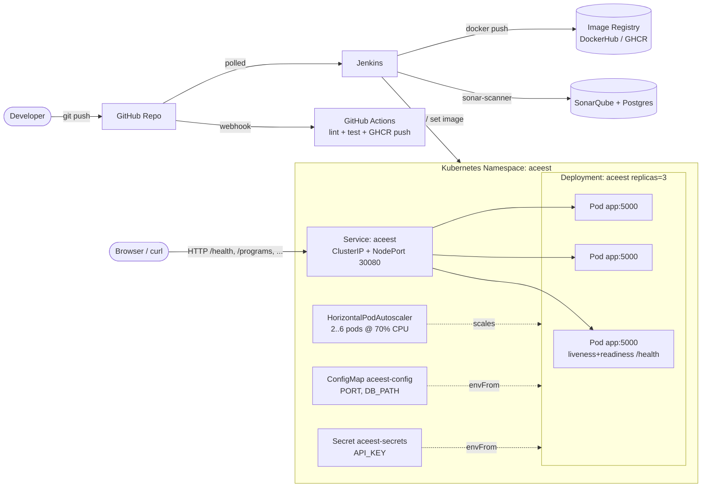
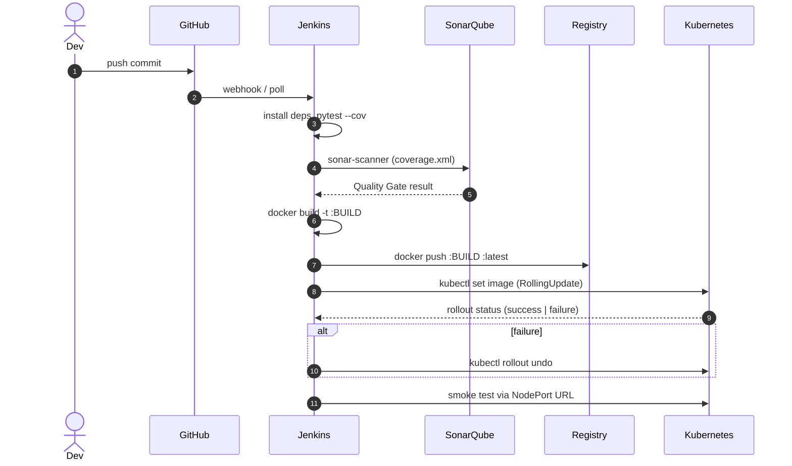

# Architecture

ACEest Fitness is a stateless Flask API packaged as an OCI container, deployed
on Kubernetes (Minikube for local demo) with three replicas behind a Service
and an HPA. All build/test/deploy steps are automated via Jenkins; GitHub
Actions provides redundant pre-merge feedback. SonarQube runs in Docker
Compose alongside the app for static analysis and quality gating.

## Logical architecture

## Data flow

## Components

| Layer | Tech | Responsibility |
|---|---|---|
| App | Flask 3 / Python 3.11 | REST endpoints; stateless except for `/client` SQLite write |
| Persistence | SQLite (file) | Demo persistence; mounted on `/data` volume |
| Container | Docker (multi-stage) | Reproducible runtime, non-root, healthcheck |
| Orchestration | Kubernetes | Replica management, rolling updates, autoscaling |
| CI primary | Jenkins | Full pipeline incl. Sonar gate, image push, deploy, rollback |
| CI secondary | GitHub Actions | Fast PR feedback, GHCR push on `main` |
| Quality | SonarQube + Postgres | Static analysis, coverage gating |
| Local IaC | Docker Compose | One-command spin-up of app + Sonar + Sonar DB |

## DevOps lifecycle mapping

| Phase | Tool(s) used in this project |
|---|---|
| Plan | GitHub Issues / branches |
| Code | Git, feature/bug branches |
| Build | Jenkins `Setup` + `Lint`, GitHub Actions `Build & Lint` |
| Test | pytest + pytest-cov (unit), `tests/integration/test_smoke.py` (integration) |
| Release | Jenkins `Docker Build` + `Docker Push` (immutable tags `:BUILD_NUMBER`) |
| Deploy | Jenkins `Deploy to Kubernetes` (`kubectl set image` rolling update) |
| Operate | Kubernetes Deployment + HPA + probes (self-healing, autoscaling) |
| Monitor | `/health` endpoint, `kubectl logs`, `kubectl get hpa` |
