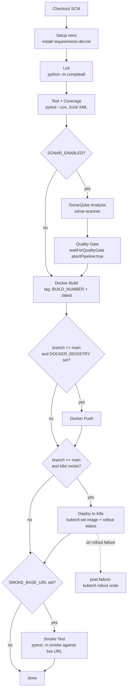
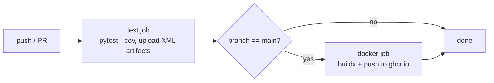

# CI/CD Pipeline Flow

The Jenkins pipeline ([Jenkinsfile](../Jenkinsfile)) is the authoritative
build-test-deploy path. GitHub Actions ([main.yml](../.github/workflows/main.yml))
runs in parallel on every push to give fast PR feedback and publishes the
image to GHCR on `main`.

## Jenkins pipeline

### Stage purposes

| Stage | Why it exists | Failure mode |
|---|---|---|
| Checkout | reproducible source | aborts build |
| Setup | isolated venv from pinned deps | aborts build |
| Lint | catches syntax errors before tests | aborts build |
| Test + Coverage | functional correctness + Sonar input | aborts build, JUnit/coverage archived |
| SonarQube Analysis | static analysis upload | aborts build |
| Quality Gate | enforce coverage/bug thresholds | aborts build (`abortPipeline:true`) |
| Docker Build | immutable artifact, tagged `:BUILD_NUMBER` | aborts build |
| Docker Push | distribute artifact | aborts build |
| Deploy to K8s | apply rolling update | aborts build, triggers rollback |
| Smoke Test | proves the **deployed** code answers traffic | aborts build, triggers rollback |
| post.failure | automatic `kubectl rollout undo` | best-effort |

## GitHub Actions pipeline (parallel safety net)

GHCR-published images use these tags:
- `ghcr.io/<owner>/aceest-fitness:<commit-sha>`
- `ghcr.io/<owner>/aceest-fitness:latest`

## Quality gates summary

| Gate | Tool | Threshold | Blocks merge / deploy? |
|---|---|---|---|
| Lint | `compileall` | 0 syntax errors | yes |
| Unit tests | pytest | all pass | yes |
| Coverage | pytest-cov | currently 96% (target ≥ 60%) | yes (via Sonar) |
| Static analysis | SonarQube | bugs = 0, vulns = 0, gate = passed | yes (`abortPipeline:true`) |
| Smoke tests | pytest `-m smoke` | all pass against deployed URL | yes (triggers auto-rollback) |
